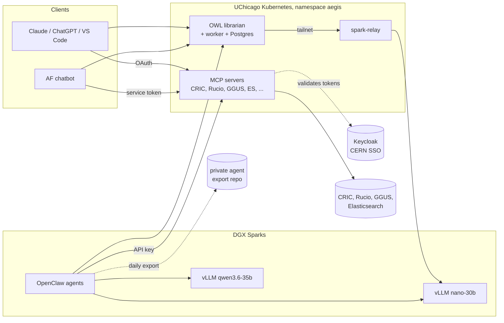

# AEGIS

**AEGIS** (AI Experimental Grid Infrastructure Sentinel) aims to improve monitoring and
operation of the distributed computing systems used by ATLAS, and potentially other LHC
experiments: workload management (PanDA), data management (Rucio and FTS), the networks
between sites, conditions data delivery, and the sites themselves. It gives AI assistants
and autonomous agents safe, authenticated access to these services, runs specialist agents
that watch them, and builds a shared, curated store of operational knowledge.

AEGIS is hosted at UChicago: its services run in the UChicago Analysis Facility (AF)
Kubernetes cluster and its agents on DGX Sparks in the UChicago network. It is **not** about
operating the AF, which is a separate project, **Elwood**. AEGIS knows about the AF as one
part of the ATLAS computing infrastructure, but has no AF-specific agents or tools.

AEGIS has four parts:

| Part | What it is | Where |
| --- | --- | --- |
| **MCP servers** | Tools that let any MCP client (Claude, ChatGPT, VS Code, OpenClaw, the AF chatbot) query CRIC, Rucio, GGUS and ATLAS monitoring data in Elasticsearch | [`mcps/`](mcps/README.md) |
| **Agents** | Specialist AI agents that watch parts of the system, write daily reports and help operators | OpenClaw on two NVIDIA DGX Sparks ([`on_prem/`](on_prem/spark2/README.md)) |
| **OWL** | The ATLAS AI Librarian: a curated, cited and versioned knowledge store | [`mcps/OWL/`](mcps/OWL/README.md) |
| **Agent state export** | A daily dump of every agent's definition and memory into git, for review and portability | [`agents-export/`](agents-export/README.md) |



---

## MCP servers

Each server runs in the UChicago AF Kubernetes cluster and speaks MCP over **Streamable
HTTP**. Full setup instructions for every client are in [mcps/README.md](mcps/README.md).

| Server | Gives the assistant | Endpoint |
| --- | --- | --- |
| [CRIC](mcps/CRIC/README.md) | ATLAS CRIC: sites, PanDA queues, DDM endpoints and their statuses | `https://cric.af.atlas-ml.org/mcp` |
| [Elasticsearch](mcps/Elasticsearch/README.md) | Search over ATLAS monitoring data in the UChicago Elasticsearch: PanDA jobs and tasks, FTS transfers, perfSONAR, WLCG site network traffic, … | `https://es.af.atlas-ml.org/mcp` |
| [GGUS](mcps/GGUS/README.md) | Read, create and update GGUS helpdesk tickets | `https://ggus.af.atlas-ml.org/mcp` |
| [Rucio](mcps/Rucio/README.md) | ATLAS Rucio: datasets, replicas, rules, RSEs | `https://rucio.af.atlas-ml.org/mcp` |
| [OWL](mcps/OWL/README.md) | The ATLAS AI Librarian (early phase) | `https://owl.af.atlas-ml.org/mcp` |

**Authentication.** Every server accepts either credential:

- **Sign in with CERN (OAuth):** for people using a client interactively. Login goes through
  the AF-platform Keycloak (realm `AF-platform`) to CERN SSO. Use the pre-registered public
  client `af-mcp`, with no client secret, and the server's own scope, e.g. `ggus-mcp`.
- **API key:** for unattended agents and scripts. Ask the maintainers for one.

Each server answers unauthenticated requests with `401` and a `WWW-Authenticate` header
pointing at its OAuth metadata, so OAuth-capable clients find the login page by themselves.

The repository also holds two AF-specific servers, [Executor](mcps/Executor/README.md) (shell
commands on AF login nodes) and [Knowledge](mcps/Knowledge/README.md) (AF user
documentation). They serve Elwood and are not deployed from here: their manifests are
commented out in [`deploy/mcps/kustomization.yaml`](deploy/mcps/kustomization.yaml).

---

## Agents

The agents run in [OpenClaw](https://openclaw.ai) on a DGX Spark. They use the MCP servers
above through API keys and talk to people in Slack and Mattermost. The same OpenClaw gateway
also hosts Elwood's AF agents (an AF orchestrator, HTCondor and Kubernetes); those are not
part of AEGIS. Their reasoning runs on
Claude, while the two Sparks also serve local models through vLLM: `nano-30b` (NVIDIA
Nemotron 3 Nano 30B) on Spark 1, and `qwen3.6-35b` on Spark 2.

| Agent | Focus |
| --- | --- |
| **Ace** (`operator`) | ATLAS Computing orchestrator with broad, architecture-level knowledge; delegates to `networker`, `rodbot`, `conditioner` and `ddmbot` |
| **Net** (`networker`) | Network monitoring for HEP: FTS transfer errors, perfSONAR, WLCG site ingress and egress |
| **RodBot** (`rodbot`) | ATLAS Distributed Processing: PanDA task monitoring and failure diagnosis |
| **Conditioner** (`conditioner`) | Health of the Frontier servers that deliver ATLAS conditions data |
| **DDM Helper** (`ddmbot`) | ATLAS Distributed Data Management (Rucio) |
| **Score Bot** (`scorebot`) | Scores, metrics and reporting for WLCG and ATLAS computing |

Agents learn while they work. They keep curated notes (`MEMORY.md`) and daily logs, and
they write and refine their own skills; changes are reviewed afterwards, not approved in
advance.

### Preserving what agents learn

Agent state is preserved in three ways:

1. **OpenClaw's built-in git backup**, to a private repository (database rows only).
2. **[Agent state export](agents-export/README.md)**: a systemd timer on the gateway host runs
   `export_agents.py` daily. It writes each agent's config, persona, skills, cron jobs and
   memory as plain files, scans them for secrets, and opens a pull request against a private
   repository. Merging the PR accepts what the agents learned. Memory is never committed to
   this public repository.
3. **Into OWL** (planned): facts about systems that agents learn will be extracted from the
   exported memory and submitted to OWL. They land in quarantine until a trusted writer
   confirms them, so any client can use the knowledge, not just OpenClaw. Procedures and
   skills stay in git; agents' personal working state is not shared.

---

## OWL — the ATLAS AI Librarian

ATLAS documentation is spread over TWiki, GitHub, Indico, slides and mail. Much of it is stale
or contradicts itself, and retrieval over raw chunks (RAG) cannot fix that at query time. OWL
moves the work to **write time**. It stores atomic **claims**, each with:

- **provenance:** a span in a stored original document;
- **two timelines:** when the claim was true, and when OWL learned it;
- **confidence and a status:** active, quarantined, disputed, superseded or retired.

New knowledge is checked against what OWL already knows. A claim made outdated by a newer one
is superseded automatically. A real conflict becomes a dispute, which goes back to the people
who made the two claims.

Status: **Phase 0 is complete.** The service, worker, Postgres with pgvector, Keycloak
identity, and the connection to the local model on Spark 1 are all deployed and verified.
`owl_status` is the only tool so far. Phase 1 (schema, hybrid search and read tools) is next.
See the [README](mcps/OWL/README.md) for the design and [TODO.md](mcps/OWL/TODO.md) for the
build plan.

---

## Deployment

| | |
| --- | --- |
| Cluster | UChicago AF Kubernetes (hosting only), namespace `aegis` |
| Delivery | Flux watches `main` of this repository and applies [`deploy/`](deploy/) (Kustomize: `base/` for namespace, secrets, RBAC, config, Postgres and the Spark relay; `mcps/` for the servers and network policy). **Pushing to `main` deploys.** |
| Images | Built by [`.github/workflows/mcp_builder.yaml`](.github/workflows/mcp_builder.yaml) on push to `main` and pushed to `harbor.af.uchicago.edu/maniaclab/mcp-server-<name>`, tagged with the date and `latest` |
| Ingress | `<name>.af.atlas-ml.org`, nginx with cert-manager |
| Secrets | SealedSecrets only: `kubeseal --controller-name sealed-secrets --controller-namespace kube-system --format yaml` |
| Isolation | Each workload has its own ServiceAccount and a Role that can read only the Secrets and ConfigMaps it uses. A NetworkPolicy lets only the ingress controller and the namespace itself reach the MCP pods |
| Scale | One replica each, no PodDisruptionBudgets |
| Local models | The campus network blocks the cluster from reaching the Sparks, so `spark-relay` (Tailscale in userspace mode plus socat) forwards OWL's requests over the tailnet to the vLLM on Spark 1. A tailnet ACL limits the relay to that one port |

---

## Repository layout

```text
mcps/            MCP servers, one directory each (TypeScript, Express, MCP SDK)
  OWL/           the AI Librarian (service, worker, design docs, build plan)
deploy/          Kustomize manifests applied by Flux
  base/          namespace, sealed secrets, RBAC, ConfigMaps, OWL Postgres, spark-relay
  mcps/          MCP Deployments, Services, Ingresses, NetworkPolicy
agents-export/   exporter of OpenClaw agent state to git, plus its systemd units
on_prem/spark2/  DGX Spark setup: vLLM docker compose, OpenClaw notes
.github/         image build workflow, CODEOWNERS
```

## Contributing

- **Never commit plaintext secrets.** Seal them with `kubeseal` (see above). `secrets/` is
  gitignored for local fill-in templates.
- Keep GitHub Actions on their latest versions.
- Each MCP server's README lists its tools, auth scope and client setup. Keep them current
  when tools change.
- Code owners are listed in [.github/CODEOWNERS](.github/CODEOWNERS).

Open work is tracked in [TODO.md](TODO.md): finishing the move from `maniaclab/af-platform`,
adding collaborators, and rechecking MCP authentication.

## License

[MIT](LICENSE) © 2026 Maniac Lab
